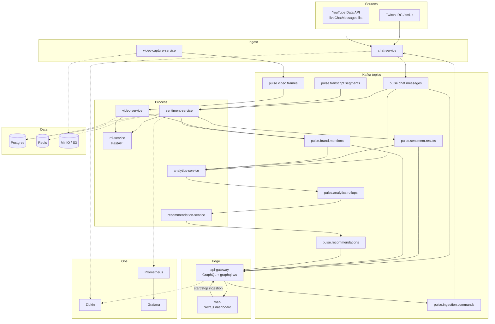

# Pulse


**Pulse** is a real-time, multi-platform live stream intelligence platform. It ingests **Twitch** and **YouTube** chat (and video frames), runs sentiment analysis and sponsor/brand-mention detection, scores **sponsor relevance**, and surfaces live analytics and operator recommendations through a GraphQL API and a Next.js dashboard.

| Surface | URL (local) |
| --- | --- |
| Dashboard | http://localhost:3001 |
| GraphQL / Playground | http://localhost:3000/graphql |
| Grafana | http://localhost:3008 (`pulse` / `pulse`) |
| Zipkin | http://localhost:9411 |
| Prometheus | http://localhost:9090 |

> **Demo:** See [docs/demo.md](docs/demo.md) for the end-to-end walkthrough (Twitch + YouTube via the dashboard). A screen capture of that flow lives at [docs/demo/pulse-demo.md](docs/demo/pulse-demo.md) until a hosted video URL is attached in the repo About section.

---

## Architecture



### Package layout

| Path | Role |
| --- | --- |
| `apps/api-gateway` | NestJS GraphQL gateway, Kafka → live subscriptions |
| `apps/chat-service` | Twitch / YouTube adapters → `pulse.chat.messages` |
| `apps/video-service` / `sentiment-service` / `analytics-service` / `recommendation-service` | Processing pipeline |
| `apps/ml-service` | FastAPI stubs for sentiment + brand relevance |
| `apps/web` | Next.js App Router dashboard (Apollo + graphql-ws) |
| `packages/event-schemas` | Zod Kafka contracts |
| `packages/kafka-client` | Typed produce/consume |
| `packages/platform-adapters` | `ChatSource` + Twitch / YouTube implementations |
| `packages/config` | Zod env loader + Secret Manager hooks |
| `packages/observability` | OpenTelemetry → Zipkin, Prometheus `/metrics` |

Design rationale is captured in [docs/adr/](docs/adr/README.md).

---

## Quick start

### Prerequisites

- Node.js **≥ 20**, [pnpm](https://pnpm.io) **11** (`corepack enable`)
- Docker Desktop (for the full local stack)
- Optional: Twitch chat credentials / YouTube Data API key for **live** adapters (not required for `make demo-seed`)

### 1. Install and build

```bash
pnpm install
pnpm build
```

### 2. Bring up the stack

```bash
make up
# equivalent: docker compose up --build -d
```

This starts Kafka, Postgres, Redis, MinIO, Zipkin, Prometheus, Grafana, and the application services. First build is slow (monorepo Docker images).

### 3. Seed a demo session (no live stream required)

```bash
make demo-seed
```

Publishes chat, sentiment, brand mentions, a rollup, and a recommendation for `demo-stream`, and registers ingestion on the gateway when it is reachable.

### 4. Open the dashboard

1. Visit http://localhost:3001  
2. Choose **Twitch** or **YouTube** in the platform selector  
3. Use stream ID `demo-stream` (or whatever you passed to the seed)  
4. Watch live chat, sentiment, brand timeline, analytics, and recommendations update

### 5. Develop without Docker (apps only)

```bash
# Terminal A — infrastructure (minimum)
docker compose up -d kafka

# Terminal B — services
pnpm --filter @pulse/api-gateway dev
pnpm --filter @pulse/chat-service dev
# …other services as needed
pnpm --filter @pulse/web dev
```

Gateway defaults: `http://localhost:3000/graphql`, API key `dev-api-key` (`x-api-key`).

### Configuration

All Nest apps load config through `@pulse/config` (`loadConfig(schema)`): fail-fast Zod validation, plain env locally, optional `secret:` / `gsm:` refs via Google Secret Manager in deployed environments. Service URLs default from `DEPLOYMENT_ENV=local|compose|kubernetes` (Compose DNS vs Kubernetes Service DNS) — see [ADR 0006](docs/adr/0006-service-discovery-and-config.md).

### Live Twitch / YouTube ingestion

| Platform | What you need | Dashboard fields |
| --- | --- | --- |
| **Twitch** | Channel login; optional IRC identity for authenticated connect | Platform → Twitch, **Channel login** = targetId, Stream ID = your stable id |
| **YouTube** | Data API key (`YOUTUBE_API_KEY`); target = live video ID | Platform → YouTube, **Live / video ID** = targetId |

Start/stop calls GraphQL `startStreamIngestion` / `stopStreamIngestion`, which publish `pulse.ingestion.commands` for `chat-service`.

---

## Sponsor-relevance scoring

Pulse ranks moments by how useful they are to a **sponsor**, not by raw sentiment alone.

For each analyzed chat or transcript event:

\[
R = 0.35\,S' + 0.40\,K + 0.25\,P \quad (R \in [0,1])
\]

| Term | Meaning |
| --- | --- |
| \(S'\) | Sentiment score mapped from \([-1,1]\) → \([0,1]\); dampened when no brand is present so purely “happy chat” does not look like a sponsorship opportunity |
| \(K\) | Strongest brand evidence: \(\max(\text{confidence} \times \text{relevance})\) from ML (or lexical fallback) |
| \(P\) | Paid attention: `1` for YouTube Super Chat / membership, else `0` (Twitch has no equivalent on this signal) |

Implementation: `apps/sentiment-service/src/scoring/sponsor-relevance.ts`. The optional `sponsorRelevance` field on `sentiment.result` feeds analytics (`averageSponsorRelevance`) and recommendation rules. Full write-up: [ADR 0003](docs/adr/0003-sponsor-relevance-scoring.md).

---

## Twitch / YouTube adapter design

Both platforms implement the same `ChatSource` contract in `@pulse/platform-adapters`:

```ts
interface ChatSource {
  readonly platform: "twitch" | "youtube";
  connect(streamId: string): Promise<void>;
  onMessage(cb: (msg: NormalizedChatMessage) => void): void;
  disconnect(): Promise<void>;
}
```

`NormalizedChatMessage` is platform-agnostic (`kind`, optional `amountMicros` / `currency`). `chat-service` maps it to the Zod `chat.message` Kafka event and **always stamps `platform`**.

| Concern | Twitch | YouTube |
| --- | --- | --- |
| Transport | IRC over WebSocket via **tmi.js** | REST **polling** `liveChatMessages.list` |
| Addressing | Channel login | Live chat ID (or resolve from video ID) |
| Resilience | Exponential reconnect / backoff | Respect `pollingIntervalMillis` |
| Rate limits | IRC reconnect budgets | **`YoutubeQuotaScheduler`** — tracks daily quota units (list cost = 5), queues/defers instead of blind retries |
| Paid signals | N/A on this adapter | Super Chat + membership → `kind` + micros |

That keeps downstream sentiment, analytics, and GraphQL identical across platforms. ADR background: event contracts ([0001](docs/adr/0001-event-contracts.md)), platforms on every event by design.

---

## Observability & CI

- **Traces:** OpenTelemetry Node SDK → **Zipkin** ([ADR 0005](docs/adr/0005-observability-backend.md))
- **Metrics:** `/metrics` on each Nest service → Prometheus → Grafana dashboard *Pulse live operations*
- **CI:** Lint, typecheck/`pnpm build`, and tests on every PR; Docker image push to GHCR + optional Kubernetes apply on merge to `main`/`master` (`.github/workflows/ci.yml`)

---

## Repository map

```
apps/           NestJS services, FastAPI ML, Next.js web
packages/       Shared schemas, Kafka, adapters, config, observability
infra/docker    Dockerfiles
infra/k8s       Kubernetes manifests
infra/observability   Prometheus + Grafana provisioning
docs/adr        Architecture Decision Records
scripts/        demo-seed.ts
```

---

## License

Private / unpublished unless otherwise noted by the repository owner.
